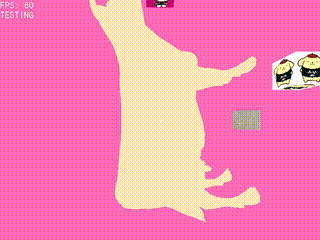
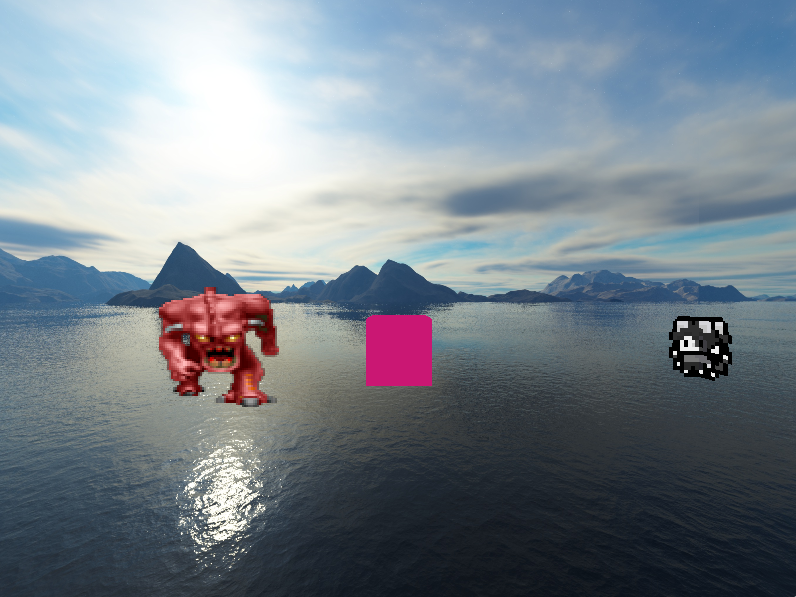

# Scarablib 🪲 v1.0
**Scarablib** is a C++ graphics library designed to simplify 2D and 3D development. It provides an easy-to-use, beginner-friendly API while still offering powerful features like resource management, custom shaders, raycasting, and more

> ⚠️ Scarablib is a **hobby project** and still under active development. You can track progress in the [`docs/todo.md`](docs/todo.md) file

Contact me on discord: **vakothebat**

Orbiting cubes, Wavefront model, Plane and the Skybox


Billboard, Cube, Two Crossed Planes and the Skybox


# Documentation
Currently, there is **no external documentation**. However, all methods are documented with comments in the source code. A [markdown file](docs/documentation.md) is planned to be added

---

# Features
- **Beginner-Friendly API**: Designed with simplicity in mind, it is easy to learn for new developers while remaining powerful enough for advanced users
- **2D and 3D development**: Easy-to-use tools for 2D and 3D rendering
	Includes:
	+ Basic 2D/3D shapes
	+ Billboards and multiple plane types
	+ Material components (Color, Shader, Texture and Texture Array)
- **Memory Management**: Automatic memory handling with a built-in resource manager and batch renderer
- **Simplified VAO creation**: Dynamic tools to create VAOs (just if needed) with minimal boilerplate
- **Built-in systems**
	+ Clock, Timer and Alarm
	+ Sounds
	+ Wavefront OBJ loading
	+ AABB
	+ 2D Terrain Map Collision
	+ 3D Uniform Grid Collison
- **Custom Shader Support**: Easily load and apply custom GLSL shaders

## Unfinished features
These features are in-progress or partially working (expect bugs/performance issues):

- **Bounding Box**: Working but unoptimized
- **Collision System**: Untested
- **Physics**: Partially implemented
- **Terrain Map Collision**: Working but unoptimized
- **Uniform Grid Collision**: Working but unoptimized
- **Fonts**: Not yet implemented (kinda lazy to add it right now)
- **Raycasting**: Untested

## Roadmap
- Physics and collision
	+ AABB, OBB, Physics Engine, Terrain Map and Uniform Grid
- Lighting support
- Networking support

---

# Libraries used
- [`SDL2`](https://www.libsdl.org/) for window management
	+ [`SDL2_mixer`](https://www.libsdl.org/projects/mixer/) for sound handling
- [`stb_image`](https://github.com/nothings/stb) for image loading
- [`stb_truetype`](https://github.com/nothings/stb) for TTF font loading
- [`glad`](https://github.com/Dav1dde/glad) for OpenGL loader
- [`glm`](https://github.com/g-truc/glm) for vector and matrix math
- [`tinyobjloader`](https://github.com/tinyobjloader/tinyobjloader) for wavefront OBJ loader

> Licenses for these libraries are in the [`licenses/`](licenses/) directory

## Dependencies
- [GLAD header](include/external/glad/gl.h)

---


# Example: Rotating Cube
This example creates a single 3D scene with a rotating cube
```cpp
#include <scarablib/window/window.hpp>
#include <scarablib/input/keycode.hpp>

int main() {
	// Window setup
	Window window = Window({
		.width = 800,
		.height = 600,
		.title = "Hello World"
	});

	// Scene3D Setup
	Scene3D scene3d = Scene3D(camera);

	// Model setup
	Cube* cube = scene3d.add<Cube>("cube"); // Add to scene for batch drawing
	cube->set_position({ 0.0f, 0.0f, -5.0f });
	cube->set_color(Colors::MAGENTA);
	cube->material.texture = new Texture("textures/cube.png");

	// Used to rotate the cube
	float angle = 0.0f;

	// Main loop
	while(window.is_open()) {
		// Window stuff
		window.clear();
		window.process_events();

		// Handle events
		if(window.has_event(Event::WINDOW_QUIT)) {
			window.close();
		}

		// Change cube's angle
		//                angle    axis (x, y, z)
		cube->set_rotation(angle, { true, true, false });
		// Draw all models added to the scene with batch drawing
		scene.draw_all();

		// Change cube's angle
		angle += 1.0f;
		if(angle >= 360.0f) {
			angle = 0.0f;
		}

		// Swap buffers
		window.swap_buffers();
	}
}
```


# Buildind the Library
## Macros
### Functionality
- `BUILD_OPGL30`: Use `OpenGL 3.0` compatible methods (default is OpenGL 4.5 DSA)

### Debug
- `SCARAB_DEBUG_VAO_MANAGER`: Logs VAO creation
- `SCARAB_DEBUG_SHADER_MANAGER`: Logs shader/program creation
- `SCARAB_DEBUG_DRAW_ALL`: Logs batch draw calls

## Static Library (Recommended)
```sh
cmake -B build -DSTATIC=1 -DCMAKE_BUILD_TYPE=Release
cmake --build build
```

## Shared Library
```sh
cmake -B build -DSHARED=1 -DCMAKE_BUILD_TYPE=Release
cmake --build build
```

> ![NOTE]
> `SDL2` and `SDL2_mixer` are not bundled. You will need to include and link them manually

## Debug Build
Compiles the test executable `build/scarablib_test` using `test/main.cpp`
```sh
cmake -B build -DSTATIC=1 -DCMAKE_BUILD_TYPE=Debug
cmake --build build
```

<!--
# Memory leaks
The library does not contains any memory leak, but if you run `valgrind` you may notice that some memory still reachable at the end of the execution. This is from SDL library. If you are using `wayland` around 800 bytes of definitly lost memory will should up
-->

## Using the Library
To use the provided [Makefile](docs/Makefile), follow this structure:
```
your_project/
├── src/               # Your .cpp files
├── lib/
│   └── scarablib/     # Built static/shared library
├── include/
│   ├── scarablib/     # Scarablib headers
│   └── external/glad/ # GLAD headers
```

Then run:
```sh
make
```

## Windows Support
Window support exists but is **untested**. You will need to ship `SDL_mixer.dll` alongside your application. Currently, only the `SDL2` **static** library is used


---

# Contributing
Scarablib is a personal project, but contributions are very welcome! Feel free to open an issue or submit a pull request if you would like to help improve it

# LICENSE
This project is licensed under a **modified zlib License**. See the [LICENSE](LICENSE) file for detailsDafor full terms

